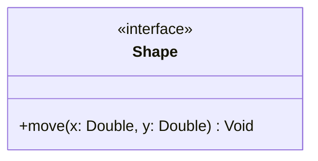
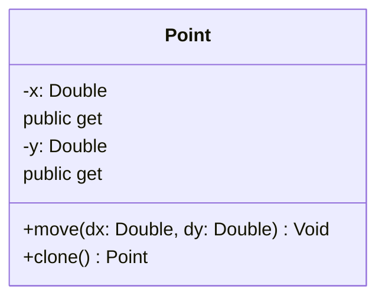

## Assignment 1 Decissions:

1. We need a base INTERFACE called shape.
2. I believe an interface is the right move here due to every shape needing to implement the same move method,
   but the move method will look a little different for every shape.
3. Move is a required method, and shapes will move along the X and Y axis, so we will need to pass in 2 parameters for the move method, X and Y.

4. UML for the interface would look like this:

5. Our first shape is a point, a point needs the following:
1. X coordinate
2. Y coordinate
3. Move method (from the interface)
4. Clone method
5. get X and Y

- Now that I have a starting point the rest of the UML will be done in lucid chart.